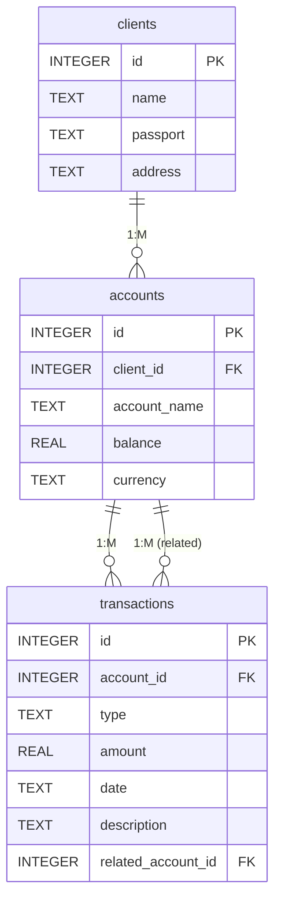

# delivery_food

Архитектура проекта

```
vyap/
  ├── src/
  │   ├── __init__.py
  │   ├── main.py
  │   ├── models/
  │   │   ├── __init__.py
  │   │   └── database.py
  │   └── ui/
  │       ├── __init__.py
  │       ├── main_window.py
  │       ├── tabs/
  │       │   ├── __init__.py
  │       │   ├── dishes_tab.py
  │       │   ├── customers_tab.py
  │       │   ├── orders_tab.py
  │       │   └── analytics_tab.py
  │       └── styles/
  │           ├── __init__.py
  │           └── styles.qss
  ├── requirements.txt
  └── food_delivery.db
```
Также внутри будет дополнительный README, настоятельно рекомендую с ним ознакомиться.
Практически весь код грамотно прокомментирован.
Присутствуют баги по тёмной теме и датам.

SS


Установка
1. Убедитесь, что у вас установлен Python 3.8 или выше
2. Установите зависимости:
```
pip install -r requirements.txt
```

Запуск приложения

```
python src/main.py
```

Функциональность

Управление блюдами
- Добавление, редактирование и удаление блюд
- Указание категории, цены и времени приготовления

Управление клиентами
- Добавление, редактирование и удаление клиентов
- Хранение контактной информации

Управление заказами
- Создание новых заказов
- Отслеживание статуса заказов
- Привязка к клиентам и блюдам

Аналитика
- Просмотр статистики по заказам
- Фильтрация по периоду и категории
- Экспорт отчетов в CSV и HTML

Особенности
- Управление блюдами (добавление, обновление, удаление)
- Управление клиентами (добавление, обновление, удаление)
- Управление заказами (добавление, обновление, удаление)
- Отслеживание статуса заказа
- Просмотр популярных блюд
- Экспорт отчетов в CSV

Требования
- Python 3.x
- ttkthemes

Текстовая схема связей:
- `clients.id` ← `accounts.client_id`
- `accounts.id` ← `transactions.account_id`
- `accounts.id` ← `transactions.related_account_id` 

Таблица блюд (`dishes`)
```sql
CREATE TABLE IF NOT EXISTS dishes (
    id INTEGER PRIMARY KEY,
    name TEXT,
    category TEXT,
    price REAL,
    cooking_time INTEGER
)
```
- id — первичный ключ;
- name — название блюда;
- category — категория блюда;
- price — цена блюда;
- cooking_time — время приготовления в минутах. 

ER-диаграмма базы данных


