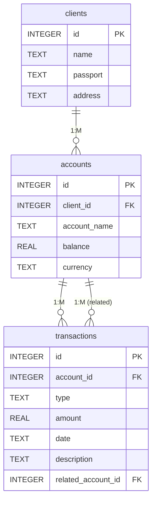

# delivery_food

Структура проекта

```
vyap/
  ├── src/
  │   ├── __init__.py
  │   ├── main.py
  │   ├── models/
  │   │   ├── __init__.py
  │   │   └── database.py
  │   └── ui/
  │       ├── __init__.py
  │       ├── main_window.py
  │       ├── tabs/
  │       │   ├── __init__.py
  │       │   ├── dishes_tab.py
  │       │   ├── customers_tab.py
  │       │   ├── orders_tab.py
  │       │   └── analytics_tab.py
  │       └── styles/
  │           ├── __init__.py
  │           └── styles.qss
  ├── requirements.txt
  └── food_delivery.db
```
Также внутри будет дополнительный README, настоятельно рекомендую с ним ознакомиться.
Практически весь код грамотно прокомментирован.
Присутствуют баги по тёмной теме и датам.

SS


Установка
1. Убедитесь, что у вас установлен Python 3.8 или выше
2. Установите зависимости:
```
pip install -r requirements.txt
```

Запуск приложения

```
python src/main.py
```

Функциональность

Управление блюдами
- Добавление, редактирование и удаление блюд
- Указание категории, цены и времени приготовления

Управление клиентами
- Добавление, редактирование и удаление клиентов
- Хранение контактной информации

Управление заказами
- Создание новых заказов
- Отслеживание статуса заказов
- Привязка к клиентам и блюдам

Аналитика
- Просмотр статистики по заказам
- Фильтрация по периоду и категории
- Экспорт отчетов в CSV и HTML

Features
- Manage dishes (add, update, delete)
- Manage customers (add, update, delete)
- Manage orders (add, update, delete)
- Track order status
- View popular dishes
- Export reports to CSV

Requirements
- Python 3.x
- ttkthemes

Installation
1. Clone the repository
2. Install the required packages:
```
pip install -r requirements.txt
```

Usage

Run the application:
```
python main.py
```

Managing Dishes
- Add new dishes with name, category, price, and cooking time
- Update existing dishes
- Delete dishes
- View all dishes in a table

Managing Customers
- Add new customers with full name, address, and phone number
- Update customer information
- Delete customers
- View all customers in a table

Managing Orders
- Create new orders by selecting customer and dish
- Update order status and assign couriers
- Delete orders
- View all orders with customer and dish information

Analytics
- View popular dishes based on order count
- Export reports to CSV

Database Structure

The application uses SQLite with three main tables:

1. dishes
   - id (PK)
   - name
   - category
   - price
   - cooking_time

2. customers
   - id (PK)
   - full_name
   - address
   - phone
   - order_history

3. orders
   - id (PK)
   - customer_id (FK)
   - dish_id (FK)
   - order_datetime
   - status
   - courier 

Описание таблиц и их связей, схема БД

Таблица клиентов (`clients`)
```sql
CREATE TABLE IF NOT EXISTS clients (
    id INTEGER PRIMARY KEY,
    name TEXT,
    passport TEXT NOT NULL UNIQUE,
    address TEXT
)
```
- id — первичный ключ;
- name — ФИО клиента;
- passport — номер паспорта клиента (формат: 2 латинские буквы и 7 цифр). Уникальное поле;
- address — адрес клиента.

---

Таблица счетов (`accounts`)
```sql
CREATE TABLE IF NOT EXISTS accounts (
    id INTEGER PRIMARY KEY,
    client_id INTEGER,
    account_name TEXT,
    balance REAL,
    currency TEXT,
    FOREIGN KEY(client_id) REFERENCES clients(id)
)
```
- id — первичный ключ;
- client_id — внешний ключ, ссылается на таблицу `clients(id)`. Указывает, какому клиенту принадлежит счет;
- account_name — название счета;
- balance — текущий баланс счета;
- currency — валюта счета (например, RUB, USD, EUR).

---

Таблица транзакций (`transactions`)
```sql
CREATE TABLE IF NOT EXISTS transactions (
    id INTEGER PRIMARY KEY,
    account_id INTEGER,
    type TEXT,
    amount REAL,
    date TEXT,
    description TEXT,
    related_account_id INTEGER,
    FOREIGN KEY(account_id) REFERENCES accounts(id),
    FOREIGN KEY(related_account_id) REFERENCES accounts(id)
)
```
- id — первичный ключ;
- account_id — внешний ключ, ссылается на таблицу `accounts(id)`. Указывает, с какого счета выполнена транзакция;
- type — тип транзакции: "Пополнение", "Снятие", "Перевод";
- amount — сумма транзакции;
- date — дата и время выполнения транзакции;
- description — описание транзакции (необязательное поле);
- related_account_id — внешний ключ, ссылается на таблицу `accounts(id)`. Указывает, на какой счет был выполнен перевод (используется только для типа "Перевод").

---

Схема базы данных

- Один клиент может иметь несколько счетов (связь один-ко-многим между `clients` и `accounts`).
- Один счет может участвовать во множестве транзакций (связь один-ко-многим между `accounts` и `transactions`).
- Для транзакций типа "Перевод" указывается дополнительный счет-получатель через поле `related_account_id` (связь многие-к-одному между `transactions` и `accounts`).

Текстовая схема связей:
- `clients.id` ← `accounts.client_id`
- `accounts.id` ← `transactions.account_id`
- `accounts.id` ← `transactions.related_account_id` 

Таблица блюд (`dishes`)
```sql
CREATE TABLE IF NOT EXISTS dishes (
    id INTEGER PRIMARY KEY,
    name TEXT,
    category TEXT,
    price REAL,
    cooking_time INTEGER
)
```
- id — первичный ключ;
- name — название блюда;
- category — категория блюда;
- price — цена блюда;
- cooking_time — время приготовления в минутах. 

ER-диаграмма базы данных


